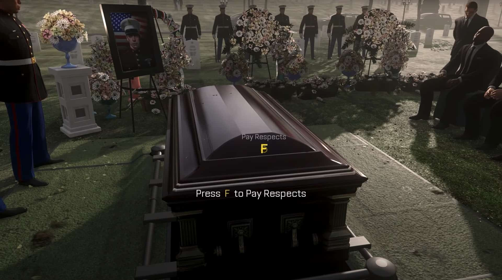

# "Press f to pay respects"
## 28/03/2019, Wikipedia

### ¿De donde salió esta expresion?

"Press f to pay respects ", es un meme de Internet que se originó en Call of Duty: Advanced Warfare , un shooter en primera persona de 2014 de Activision . En la franquicia de Call of Duty. Se originó como un conjunto de instrucciones transmitidas durante un evento en el juego y se producía en un funeral. En un principio lo tomaron como una broma por críticos y jugadores debido a su elemento forzado de interactividad que no se percibía como una reaccion de buen gusto, la frase se convertiría más tarde en un notable meme de Internet por derecho propio. A veces los comentaristas de Internet lo utilizan para transmitir solidaridad y simpatía, ya sea sarcástica o sincera, en respuesta a acontecimientos desafortunados.

[Volver atras](../index.md)
