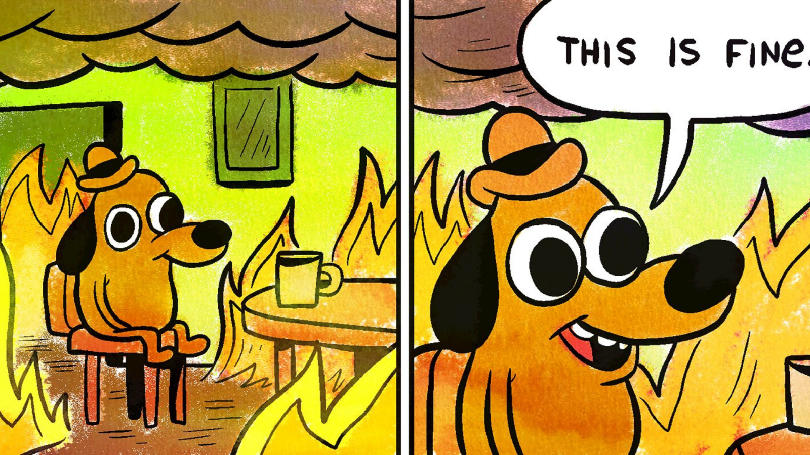

# This is Fine
## 27/02/2021, 09:05, RTVE

### ¿Quien esta detras del meme?

El perro antropomorfo que aparece sentado en una casa en llamas y que protagoniza el meme ‘This is fine’ no es reciente. El protagonista se llama Question Hound y su origen está en el webcómic número 648 de ‘Gunshow’. Pertenece al ilustrador KC Green, que lo publicó el 9 de enerode 2013. El título real de la viñeta es ‘The Pills Are Working’ o ‘On Fire’ pero se popularizó como ‘This is fine’ por el comentario que hace el personaje en la historieta. Todo un mensaje de autoconvicción frente a la catástrofe.

Reddit fue la red social que le sirvió de trampolín por 2014, como suele suceder con la mayoría de memes. Aunque solo se viralizaron dos viñetas del cómic, la historia cuenta con seis y en la última de ellas podemos ver al perro derritiéndose. Desde entonces, todo el mundo se ha apropiado de la caricatura para representar una situación tan mala que nosotros mismos nos negamos a creerla. Sin embargo, no es la primera vez que alguna de las obras de KC Green se hace viral y prueba de ello son Dickbutt, Staredad o Mother of God, aunque ninguna de ellas alcanzó la fama de Question Hound

[Volver atras](../index.md)